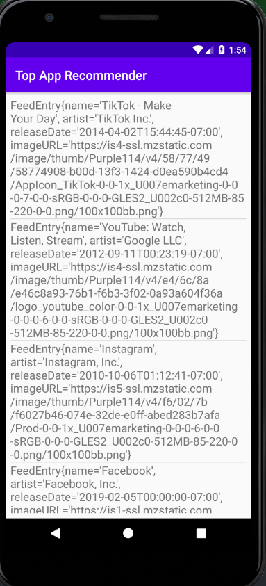

# Android

## Top App Recommender

  This android project builds an app that subscribes and downloads XML data from a RSS feed.  
  *PS: Project is built in java*  
  Some of the main features used in this project are:  
  * Accessing Internet over andorid  
  * Understanding the protection levels of getting system feature accesses (https://developer.android.com/guide/topics/permissions/overview#normal-dangerous)
  
  **URL:** http://ax.itunes.apple.com/WebObjects/MZStoreServices.woa/ws/RSS/topfreeapplications/limit=10/xml  
  We use this downloaded XML data to display as a "list of Recommended Apps".
  
  ### Phase1:
  ***  
  As part of the first phase of the project, I have built a simple listView that displays the data directly on the screen as a scrollable list with an overriden toString().  
  **Screen:**  
    
  
`ReadMe Build to be completed`  

